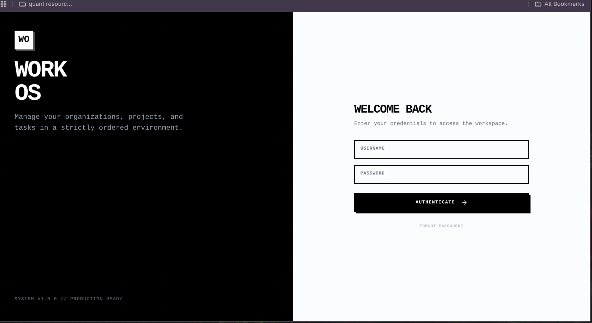
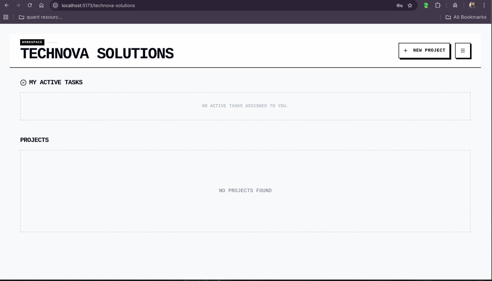
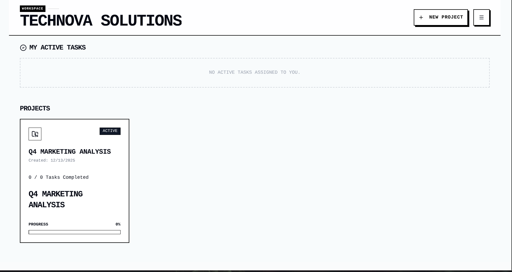
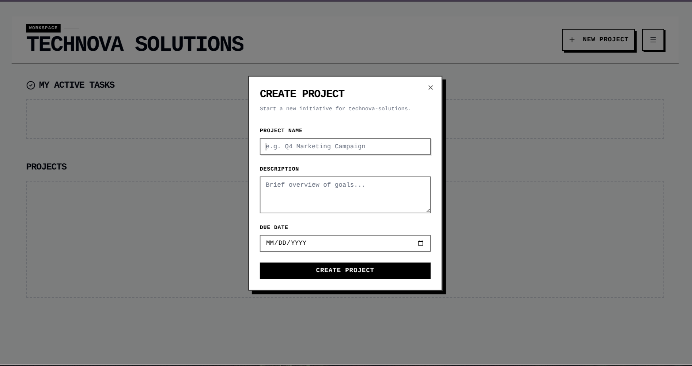
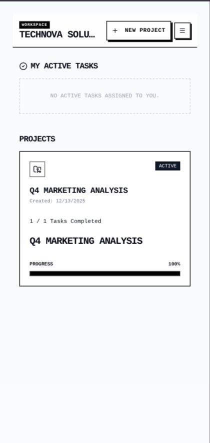

# Multi-tenant Project Management System

A Project Management application featuring a drag-and-drop Kanban board, strict organization-based data isolation, and a monochrome UI design.

## Quick Start

You only need **Docker** installed to run this entire stack.

1. **Clone the repository** (if applicable) and navigate to the root folder:
   ```bash
   cd multi-tenant
   ```

2.  **Start the application:**
    This command builds the Frontend, Backend, and Database containers and automatically seeds sample data.

    ```bash
    docker-compose up --build
    ```

3.  **Wait for the logs to settle.**
    The backend will wait for the database, run migrations, seed data, and then start the server.

-----

## Accessing the App

### **Frontend**

  - **URL:** [http://localhost:5173](https://www.google.com/search?q=http://localhost:5173)
  - **Action:** You will see a "Select Organization" screen.
  - **Enter Slug:** `technova-solutions` (Pre-seeded data)

### **Backend API (GraphQL)**

  - **URL:** [http://localhost:8000/graphql](https://www.google.com/search?q=http://localhost:8000/graphql)
  - You can run direct queries against the API here.

-----

## Demo
<p align="center">
  
  
  
  
  
  
</p>

## Demo Video Drag-Drop

## Key Features

  * **Multi-tenancy:** Strict data isolation based on Organization URL slugs.
  * **Kanban Board:** Interactive **Drag-and-Drop** task management (powered by `@dnd-kit`).
  * **Optimistic UI:** Instant visual feedback for drag operations before server confirmation.
  * **GraphQL API:** Efficient data fetching with nested relationships (Org -\> Project -\> Tasks -\> Comments).
  * **Monochrome UI:** Custom implementation of **Shadcn UI** + Tailwind CSS with a "No Round Edges" aesthetic.
  * **Automated Seeding:** The app comes pre-loaded with an Organization, Project, and Sample Tasks.

## Tech Stack

  * **Frontend:** React (Vite), TypeScript, TailwindCSS, Apollo Client
  * **Backend:** Python, Django, Graphene (GraphQL)
  * **Database:** PostgreSQL 15 (Alpine)
  * **Infrastructure:** Docker Compose (Optimized Alpine/Slim images)

-----

## 🔧 Troubleshooting

  * **"Port already allocated":** If ports 8000 or 5173 are busy, open the `.env` file in the root directory and change `BACKEND_PORT` or `FRONTEND_PORT`, then run `docker-compose restart`.
  * **"Connection Refused" on startup:** The backend automatically retries connection to the database. Just wait 2-5 seconds for the container to self-correct.

